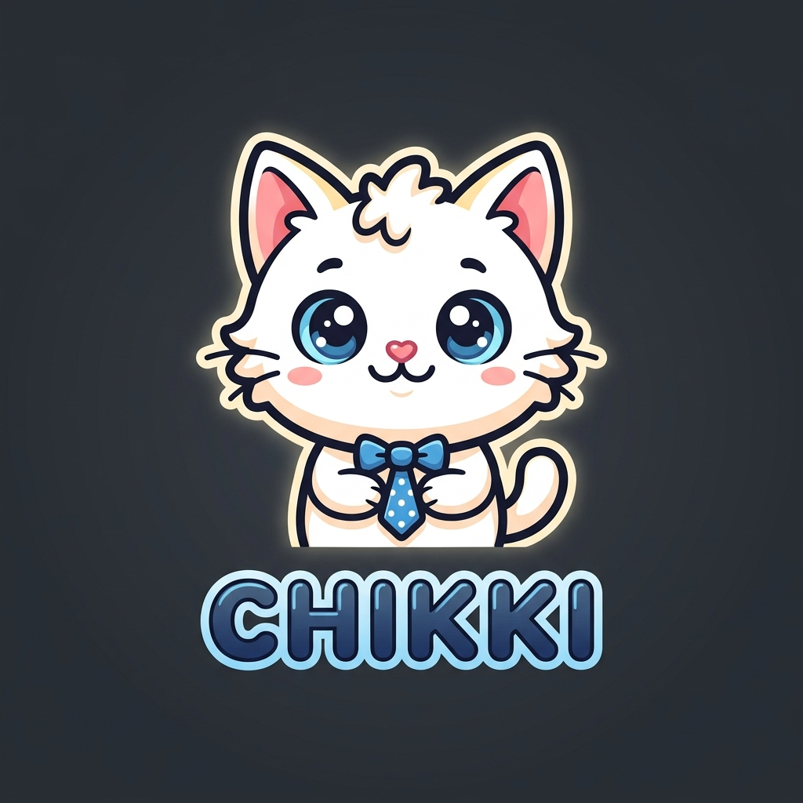

<div align="center">



# Chikki AI 🐱

**A premium PWA AI chatbot that actually remembers you.**
*Direct Gemini Voice · Offline Cache · 8 Stunning Themes · File Uploads*

[](https://YOUR-USERNAME.github.io/chikki)
[](https://ai.google.dev)
[](https://web.dev/explore/progressive-web-apps)
[](https://pages.github.com)

</div>

---

## ✨ What is Chikki?

Chikki is a **fully client-side Progressive Web App (PWA) chatbot** that runs in your browser with zero server code. It connects directly to Google's **Gemini API** using secure headers, storing your **full conversation history** locally in your browser so Chikki has persistent memory of everything you say.

---

## 🚀 Features

| Feature | Description |
|---------|-------------|
| 🧠 **Persistent Memory** | Stores chat history in `localStorage` — Chikki retains context across refreshes |
| 🎤 **Direct Gemini Voice** | Native `MediaRecorder` audio capturing — sends audio directly to Gemini. No browser Speech-to-Text needed |
| 🔊 **Voice Playback** | Listen back to your recorded voice notes directly in the chat bubbles |
| 📱 **PWA Standalone** | Installable as a native app on Android, iOS, Windows, and macOS |
| ❄️ **Offline Cache** | Service worker caches files for immediate load speeds and offline launch |
| 🎨 **8 HSL Themes** | Purple Night · Ocean Blue · Rose Blossom · Forest · Sunset · Nord · Midnight · Candy |
| 🔑 **`AQ.` Keys Support** | Fully compatible with new Google AI Studio API key formats via custom headers |
| 📎 **File Uploads** | Attach images, PDFs, code files — Gemini analyzes them instantly |
| 🌊 **SSE Streaming** | Word-by-word streaming responses (no loading spinners) |
| 💻 **Code Highlighter** | Syntax-highlighted code blocks with a one-click copy button |
| 🔍 **Full-Text Search** | Search through all your stored chats |
| ✨ **Dynamic Glows** | Particles and mascot shadows glow dynamically depending on active theme |

---

## 🎬 Quick Start

### Option 1 — Use directly (GitHub Pages)

👉 **[Open Chikki](https://YOUR-USERNAME.github.io/chikki)**

1. Click **⚙️ Settings**
2. Paste your [free Gemini API key](https://aistudio.google.com/apikey)
3. Start chatting or recording voice commands!

### Option 2 — Run locally

```bash
# Clone the repo
git clone https://github.com/YOUR-USERNAME/chikki.git
cd chikki

# Start a simple server (required for microphone access)
python -m http.server 8080

# Open in browser
# http://localhost:8080
```

---

## 🔑 Getting Your Free API Key

1. Go to **[Google AI Studio](https://aistudio.google.com/apikey)**
2. Sign in with your Google account and click **"Create API key"**
3. Copy the key (both `AIza...` and new secure `AQ.`-prefixed keys are supported!)
4. In Chikki → click **⚙️ Settings** → paste key → **Save**

---

## 🤖 Supported Models

| Model | Rate Limit (Free) | Best For |
|-------|-------|---------|
| **Gemini 3.5 Flash** ⭐ | 1,500 RPD / 15 RPM | Daily chats, coding, voice processing |
| Gemini 3.1 Flash Lite | 1,500 RPD / 15 RPM | Quick Q&A, lightweight lookup |
| Gemini 3.1 Pro Preview | 100 RPD / 2 RPM | Complex logic & deep reasoning |
| Gemini 2.5 Flash | 1,500 RPD / 15 RPM | Standard tasks |
| Gemini 2.5 Pro | 100 RPD / 2 RPM | Long context |

---

## 🏗️ Structure & Tech Stack

```
Chikki/
├── index.html      — App structure (modals, inputs, PWA headers)
├── style.css       — Design tokens (8 themes, glassmorphism, responsive queries)
├── app.js          — Logic (Gemini API, MediaRecorder voice, PWA installer)
├── manifest.json   — Web App Manifest (metadata, colors, icons) [NEW]
├── sw.js           — Service Worker (offline asset caching) [NEW]
└── cat-logo.png    — Cartoon mascot (AI-generated)
```

**Zero dependencies. No build step. No backend.**

| Layer | Technology |
|-------|-----------|
| Structure | Vanilla HTML5 |
| Styling | Vanilla CSS (CSS Variables, Glassmorphism, Responsive Media) |
| Logic | Vanilla JavaScript (ES6+ Modules) |
| API Auth | Custom secure `x-goog-api-key` header (protects `AQ.` keys) |
| Audio | Browser native `MediaRecorder` API (captures WebM/WAV blobs) |
| Caching | Service Worker API |
| Markdown | marked.js (CDN) |
| Code Highlight | highlight.js (CDN) |
| Icons | Lucide Icons (CDN) |

---

## ⌨️ Keyboard Shortcuts

| Shortcut | Action |
|----------|--------|
| `Enter` | Send message |
| `Shift + Enter` | New line |
| `Ctrl + K` | New conversation |
| `Escape` | Close settings / confirm modals |

---

## 🔒 Privacy & Safety

- ✅ **API Key Protection**: Stored strictly in your browser's local sandbox (`localStorage`)
- ✅ **Conversations**: Saved locally; never uploaded to any database
- ✅ **Zero Telemetry**: No trackers, no cookies, no third-party scripts
- ✅ **Open Source**: Verify all API transactions in `app.js`

---

## 🛠️ Deploy to GitHub Pages

```bash
# 1. Fork or clone this repo
git clone https://github.com/YOUR-USERNAME/chikki.git

# 2. Push to your GitHub Pages
cd chikki
git add .
git commit -m "🐱 Deploying Chikki PWA"
git push origin main

# 3. Turn on GitHub Pages
# GitHub Settings → Pages → Build and deployment → Branch: main -> / (root) -> Save
```

---

## 📄 License

MIT License — free to use, modify, and distribute.

---

<div align="center">

Made with 💜 and lots of ☕

**[⭐ Star this repo](https://github.com/YOUR-USERNAME/chikki)** if Chikki made you smile! 🐱

</div>
